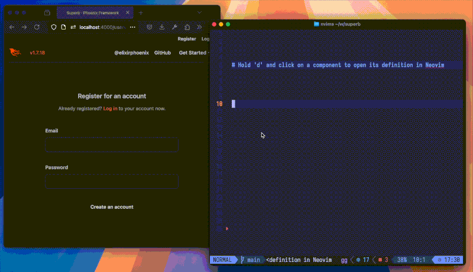

# HammerSpoon - Open in Neovim

Set up a [HammerSpoon](https://www.hammerspoon.org/) URL event to open a file
in neovim. Can be used with
[phoenix-live-reload](https://github.com/phoenixframework/phoenix_live_reload)
to jump to the definition (or caller) of a phoenix live-view component.



- [Installation](#installation)
- [API Documentation](#api-documentation)
  - [Configuration Options](#configuration-options)
  - [URL Format](#url-format)
- [Usage Examples](#usage-examples)
  - [Minimal: One Instance of Neovim](#minimal-one-instance-of-neovim)
  - [Realistic: Multiple Instances of Neovim](#realistic-multiple-instances-of-neovim)
- [License](#license)

## Installation

First, install [HammerSpoon](https://www.hammerspoon.org/).

Then, clone this repository to `~/.hammerspoon/Spoons/OpenInNeovim.spoon`, like
so...

```sh
git clone https://github.com/JuneKelly/OpenInNeovim.spoon ~/.hammerspoon/Spoons/OpenInNeovim.spoon
```

## API Documentation

In hammerspoon code (either in the console, or in `~/.hammerspoon/init.lua`),
this spoon can be loaded like so:

```lua
openInNeovim = hs.loadSpoon("OpenInNeovim")
```

To bind a URL event handler, call `openInNeovim.bind`, with a table of
configuration options.

### Configuration Options

- `token`: (required, minimum length 12 characters) the URL _must_ include this
token as a query parameter `token`. If the URL does not contain this parameter,
or it does not match, then the error will be shown in a notification.
  - Why is this required? As much as we try to defend against security issues,
  in some sense this feature is fundamentally built around telling `nvim` to
  execute some code, so it is best to guard the entry-point so it can only be
  activated by URLs having this secret token.

- `nvimPath`: (required) full path to the `nvim` executable
  - (this can be found easily by running `command -v nvim` in your shell)

- `nvimServerPipePath`: (required) full path to the `nvim` server pipe file
  - (this is the file path you provided when starting `nvim` with the
  `--listen` flag)

- `eventName`: (optional, default `"openInNeovim"`) name of the hammerspoon
event, which in practice means the part of the URL that comes after
`hammerspoon://`.

- `foregroundApp`: (optional, default `nil`) if present, bring this app to the
foreground after the file has been opened. Must be the name of a MacOS app,
like `"iTerm2"` or `Ghostty`

- `translateRootPath`: (optional, default `nil`) a table with two fields:
`from`, and `to`. If non-nil, the file path is altered to replace the segment
matching `from` at the start, with to string `to`. Useful if your phoenix
server runs in a docker environment where it's filesystem is different from the
host where your `nvim` editor is running

- `skipValidateFileExists`: (optional, default `false`) By default, we check
that the target file path is a real path, and exists, before sending the
command to `nvim`. This helps defend against remote code execution attacks. If
this option is set to `true`, the validation is skipped. This could be useful
if the `nvim` instance is operating on a different filesystem from hammerspoon.

Here's an example using all of the configuration options:

```lua
openInNeovim = hs.loadSpoon("OpenInNeovim")

openInNeovim.bind({
  nvimPath = "/opt/homebrew/bin/nvim",
  nvimServerPipePath = "/Users/somebody/.cache/nvim/server.pipe",
  token = "a_dreadful_secret",
  foregroundApp = "iTerm2",
  eventName = "aNiceCustomEventName",
  translateRootPath = {
    from = "/app/inside/docker/",
    to = "/Users/somebody/projects/cool-web-app/"
  }
})
```

### URL Format

This event handler is triggered by opening a URL that looks like:

```txt
hammerspoon://openInNeovim?file=<File Path>&line=<Line Number>
```

The following query parameters are supported:

- `file`: (required) path to the file to open (URL encoded)
- `line`: (required) line number to open
- `token`: (optional) secret token to check against `config.token`

## Usage Examples

As a pre-requisite, we need to find the full path to the `nvim` executable:

```sh
command -v nvim
```

If you've installed neovim via [homebrew](https://brew.sh), then the result is probably something like `/opt/homebrew/bin/nvim`.

### Minimal: One Instance of Neovim

In this example, we have one instance of `nvim`, acting as a server. We then
configure OpenInNeovim to open files in this single `nvim` server. If you tend
to work on one project at a time, this should be sufficient.

#### 1. Start `nvim` with `--listen`, and a path to a pipe file

To start `nvim` in server mode, we pass the `--listen <path>` parameter, where
`<path>` is a path to a pipe file, which neovim will create:

```sh
nvim --listen ~/.cache/nvim/server.pipe
```

You can make this easier to do repeatedly by creating an alias. For example, in
`zsh`:

```sh
# add this to .zshrc
alias nvim-server 'nvim --listen ~/.cache/nvim/server.pipe'
```

...or in `fish`:

```sh
# run this once in fish shell
alias --save nvim-server='nvim --listen ~/.cache/nvim/server.pipe'
```

#### 2. Generate a secret token

We need a secret token, to secure this URL endpoint. An easy way to do this is
by running `uuidgen` in the shell:

```sh
uuidgen
# => 07048977-9...
```

#### 3. Configure OpenInNeovim, in the Hammerspoon config file

Add the following to `~/.hammerspoon/init.lua`:

```lua
openInNeovim = hs.loadSpoon("OpenInNeovim")

openInNeovim.bind({
 nvimPath = "<full path to nvim executable>",
 nvimServerPipePath = "<full path to nvim server pipe>",
 token = "<random token string>",
})
```

Quit and re-open Hammerspoon. Look in the Hammerspoon console, and you should
see log lines indicating that OpenInNeovim has been loaded, and a URL handler
has been bound:

```txt
2024-12-26 14:26:31: -- Loading Spoon: OpenInNeovim
2024-12-26 14:26:31: [OpenInNeovim] Bind {
  ...
}
2024-12-26 14:26:31: [OpenInNeovim] Binding to URL 'openInNeovim'
```

#### 4. Configure `phoenix_live_reload` to trigger this URL event

See the ["Jumping to HEEX Function
Definitions"](https://github.com/phoenixframework/phoenix_live_reload?tab=readme-ov-file#jumping-to-heex-function-definitions)
section of the `phoenix_live_reload` README file.

```txt
PLUG_EDITOR = 'hammerspoon://openInNeovim?token=<TOKEN>&file=__FILE__&line=__LINE__'
```

Now, when you hold `d` and click a phoenix live-view component in the browser,
it _should_ open the component definition in neovim, and show a notification to
that effect. If not, check the hammerspoon logs.

### Realistic: Multiple Instances of Neovim

The previous example doesn't work so well if we tend to keep multiple instances of neovim open at a given time, like if we work on several projects at once. In this case, we want to start multiple neovim servers, one for each project, and configure multiple instances of OpenInNeovim, each pointing to the relevant neovim server.

#### 1. Start `nvim` with `--listen`, and a pipe file derived from the PWD

TODO

## License

This software is published under the MIT license:

Copyright 2025 June Kelly

Permission is hereby granted, free of charge, to any person obtaining a copy of
this software and associated documentation files (the “Software”), to deal in
the Software without restriction, including without limitation the rights to
use, copy, modify, merge, publish, distribute, sublicense, and/or sell copies
of the Software, and to permit persons to whom the Software is furnished to do
so, subject to the following conditions:

The above copyright notice and this permission notice shall be included in all
copies or substantial portions of the Software.

THE SOFTWARE IS PROVIDED “AS IS”, WITHOUT WARRANTY OF ANY KIND, EXPRESS OR
IMPLIED, INCLUDING BUT NOT LIMITED TO THE WARRANTIES OF MERCHANTABILITY,
FITNESS FOR A PARTICULAR PURPOSE AND NONINFRINGEMENT. IN NO EVENT SHALL THE
AUTHORS OR COPYRIGHT HOLDERS BE LIABLE FOR ANY CLAIM, DAMAGES OR OTHER
LIABILITY, WHETHER IN AN ACTION OF CONTRACT, TORT OR OTHERWISE, ARISING FROM,
OUT OF OR IN CONNECTION WITH THE SOFTWARE OR THE USE OR OTHER DEALINGS IN THE
SOFTWARE.
